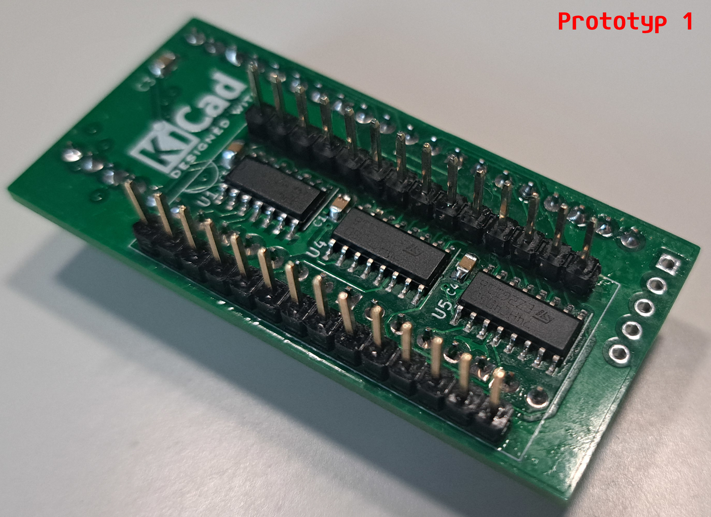
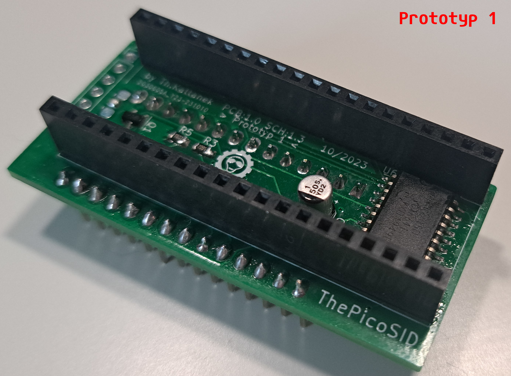
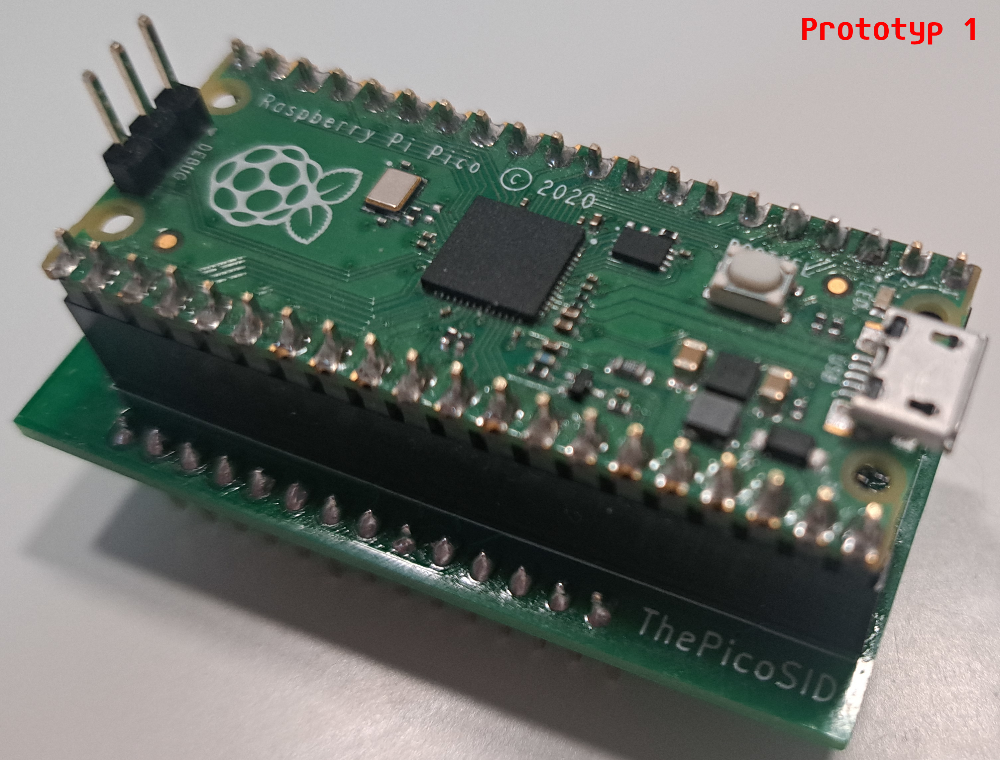
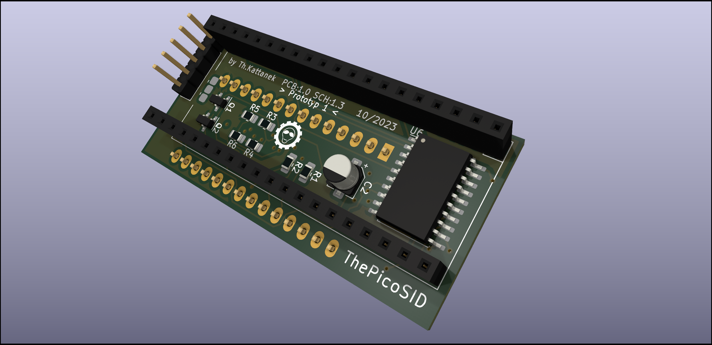
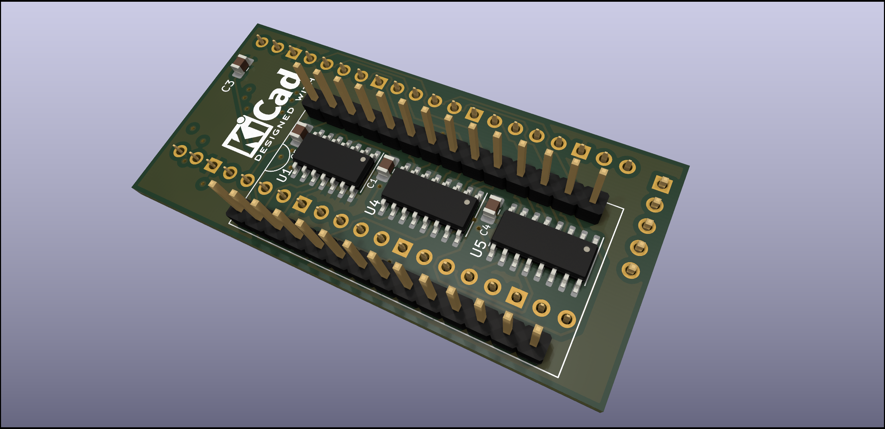

# ThePicoSID
This is a MOS-6581 / MOS-8580 replacement on the base from reSID on the raspberry pi pico or rp2040.
The first pcb prototype, for stable testings.

#### Here are a few videos of me in german lnguage.

